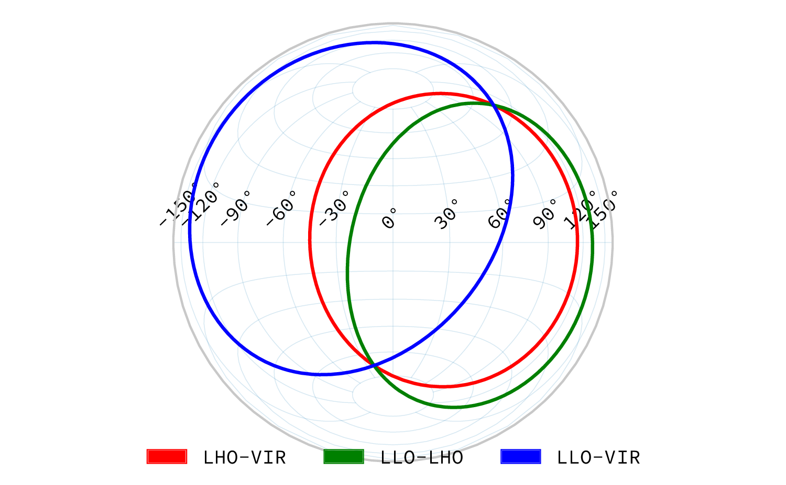
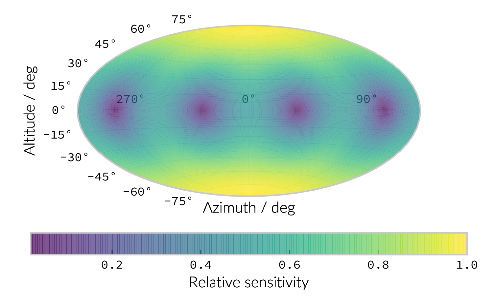

Preparing GW alerts
===================

.. glossary:macros::
.. simacros::
		     
While :glossary:abbr:`gw` detections can be interesting in their own right, the development of :glossary:abbr:`mma` relies on rapid communication between the :glossary:abbr:`gw` detectors and :glossary:abbr:`em` observatories.
This is challenging, as not all :glossary:abbr:`gw` events are likely to produce :glossary:abbr:`em` emission, and the location of the event in the sky must be determined.
Once these quantities are determined :glossary:abbr:`gw` events are reported using the :glossary:abbr:`gcn` and on ``GraceDB`` (see
https://gracedb.ligo.org/superevents/public/O3/).

Localising GW signals on the sky
--------------------------------

If a network of at least two geographically separated detectors observes
a signal it is possible to ascertain the location in the sky,
:math:`\hat{\vec{\Omega}}`, from the difference in arrival times between
the two sites.
For a detector at a position, :math:`\vec{r}_{D}`, and an
arbitrary reference location, :math:`\vec{r}_{0}`, this time delay,
:math:`\delta t`, will be

.. math:: \delta t (\hat{\vec{\Omega}}) = \frac{1}{c} (\vec{r}_{0} - \vec{r}_{D}) \cdot \hat{\vec{\Omega}}.
   :label: eq:intro:detectors:timedelay

.. _figAdvancedTiming:

   Isochrones for the three detector pairs in the advanced network. 
   For a single detector pair the localisation is a ring; with three detectors there are three pairs of detectors, and so three rings, and we can reduce the plausible locations the signal could have come from to the two places where all of the rings overlap.

This allows the location of the signal to be confined to a ring on the sky corresponding to constant :math:`\Delta t`.
Examples of these rings for a :glossary:abbr:`gw` source are plotted in :num:`figure #figadvancedtiming`.
Timing uncertainty in the signal, which arises both from clock uncertainties and uncertainties in defining a reference point in the
received signal increase the area of this region.
As more detectors are added to the network it is possible to reduce this area, as increasing the number of detector pairs works to reduce the sky area compatible with the observed delay times.
  

Additional localisation information can be attained from the observed amplitude of the signal in each detector.
The signal will be convolved with the antenna pattern (see figure ref:fig:det:aligo-antenna); as each detector is insensitive to some regions of the sky, the total plausible localisation of the signal is reduced.

For a :glossary:abbr:`gw` approaching the detector from an azimuth (relative to one of the arms) and altitude (relative to the plane of the detector), :math:`(\alpha, \delta)` on the sky these patterns for the :math:`+`- and :math:`\times`-polarisations, :math:`F_{+}` and :math:`F_{\times}`, will be

.. math::
   :nowrap:
   :label: eq:detectors:antennapattern:plus
	   
   \begin{align}
   F_{+} &= \frac{1}{2} (1 + \sin^{2}\delta) \cos 2\alpha \cos 2\psi - \sin\delta\sin 2 \alpha \sin 2 \psi \\
   F_{\times} &=  \frac{1}{2} (1 + \sin^{2}\delta) \cos 2\alpha \sin 2\psi - \sin\delta\sin 2 \alpha \cos 2 \psi.
   \end{align}

where :math:`\psi` is the polarisation angle of the :glossary:abbr:`gw`.
This gives a sensitivity pattern which is plotted in :num:`figure #figadvancedantennapattern`, which shows the sensitivity of a detector with two arms aligned North-South (along 0 azimuth) and East-West (along 90 azimuth).

.. _figAdvancedAntennaPattern:

   Antenna pattern of an aLIGO detector, normalised so that the locations which the detection is most sensitive to are labelled :math:`1`, and those it is insensitive to are labelled :math:`0`.

Determining EM bright
---------------------

It's important to be able to determine if the source of a :glossary:abbr:`gw` is likely to produce :glossary:abbr:`em` radiation which can be observed by conventional observatories.
An important part of this is determining if the source of a signal was a :glossary:abbr:`bbh` or a :glossary:abbr:`bns`.
To do this we need to consider two quantities: the :glossary:gls:`chirp-mass` of the system, which can be measured directly from the waveform, and the compactness of the system, which can be determined by identifying the moment that the
system merges in the waveform.

The :glossary:gls:`chirp-mass`, :glossary:mathsymbol:`chirp-mass`, can be determined if the frequency, :math:`f_{\text{GW}}`, and the frequency derivative, :math:`\dot{f}_{\text{GW}}`, with respect to time of the :glossary:abbr:`gw` are measured :cite:`Gw150914BasicPhysics`:

.. math::
   \label{eq:chirp-mass-frequency}
   \chirpmass = \frac{c^3}{G} \left[ \left( \frac{5}{96} \right)^{3} \pi^{-8} f_{\text{GW}}^{-11} \dot{f}_{\text{GW}}^{3} \right]^{1/5}.

This can be integrated with respect to time to remove the explicit
dependence on :math:`\dot{f}_{\text{GW}}`:

.. math::
   
   \label{eq:chirp-mass-frequency-int}
   f_{\text{GW}}^{-8/3} (t) = \frac{(8 \pi)^{8/3}}{5} \left( \frac{G \chirpmass}{c^3} \right)^{5/3} (t_{\text{c}} - t),

where :math:`t_{\text{c}}` is the time at which the two objects
coalesce. Thanks to this equation it is possible to determine the chirp
mass using the time periods between zero-crossings of the signal.

The gls:chirp-mass gives an important indicator that a system is a
:glossary:abbr:`bbh` rather than a :glossary:abbr:`bns`, since there are good physical reasons
to believe neutron stars have an upper mass limit (the
Tolman-Oppenheimer-Volkoff limit) around :si:`2.17 solmass`. It does
not, however, exclude the system being the result of two low-mass black
holes coalescing. To exclude this possibility we must calculate the
compactness of the binary close to the merger: black holes are
physically denser and more compact than neutron stars, and so can
produce a more compact orbit before merging.

The compactness of the system will be affected by spin and orbital
eccentricity, but for simplicity we can consider the compactness of a
non-spinning system where the orbit close to the merger is almost
circular  [4]_. This can be determined by measuring the frequency of the
orbit immediately prior to the merger, :math:`\omega_{\text{max}}`,
which coincides with the time when the :glossary:abbr:`gw` amplitude is greatest
(recalling that the :glossary:abbr:`gw` frequency is **twice** the orbital
frequency). The orbital separation, :math:`R` of the objects in the
binary is

.. _orbitalseparation:
.. math:: R = \left( \frac{GM}{\omega_{\text{max}}^2} \right)^{1/3},   

where :math:`M` is the total mass of the binary.

For a :glossary:abbr:`bbh` similar to GW150914, where :math:`M \approx` :si:`70 solmass`
we find that :math:`R =` :si:`350 kilometer`: this is small in comparison to the normal diameters of stars, but it's a little difficult to see the implications of this for compact objects.

To help with this we introduce the compactness ratio, :math:`\mathcal{R}`, which is the ratio of :math:`R` to the Schwarzchild radius, which is the smallest possible radius of a compact object.

.. math::

   \def\solMass{\mathrm{M}_{\odot}}
   r = \frac{2Gm}{c^{2}} \approx 2.95 \left( \frac{m}{\solMass} \right) \,\text{km}

In the GW150914-like case above :math:`\mathcal{R} \approx 1.7`, since
the Schwarzchild radius of the individual objects is :si:`103 kilometer`.
For a :glossary:abbr:`bns` system we expect :math:`\mathcal{R}` between around :math:`2` and :math:`5`.

.. [4]
   For a fuller discussion of the effects of spin and the orbit on the
   determination of the orbital compactness see section 4 of
   cite:2017AnP...52900209A.
