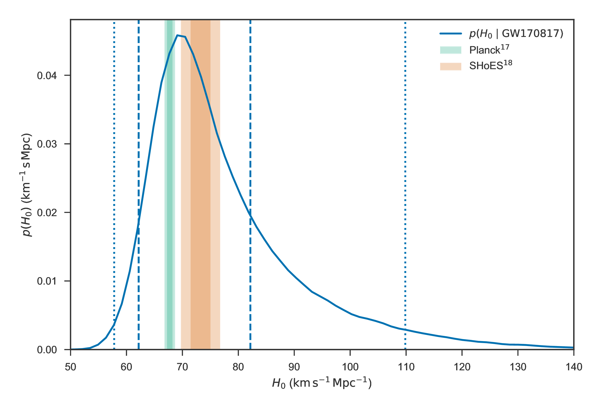
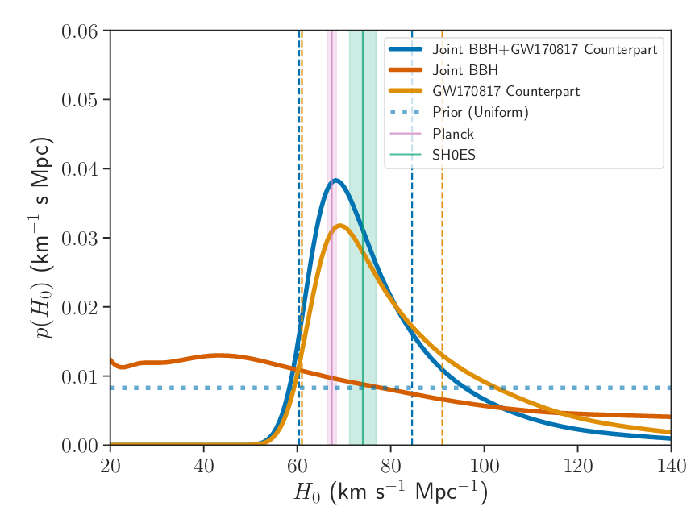

Cosmology from multimessenger astronomy
=======================================

The observation of an :glossary:abbr:`em` counterpart to GW170817 allowed the galaxy it originated in to be identified.
In turn this allowed the recession velocity of the :glossary:abbr:`bns` to be determined with high precision from its redshift.
The :glossary:abbr:`gw` detection allows the distance to the source to be measured directly (although with a fairly large uncertainty, thanks to a degeneracy between the distance to the source and the angle at which it is inclined relative to the observer.

Since the distance, :math:`d`, and recession velocity, :math:`v`, are related by Hubble's Law,

.. math::
   
   v = H_{0} d

if we know both :math:`v` and :math:`d` we can infer :math:`H_{0}`.

The distance to the source of GW170817 inferred from the :glossary:abpl:`gw` is :uncert:`48.8+2.9-6.9`:si:`megaparsec`, and the measured recession velocity is :math:`v = {3017\pm166}`:si:`kilometer second^-1`.

This allowed :math:`H_{0}` to be inferred to be :math:`{70.0^{+12.0}_{-8.0}}`:si:`kilometer second^-1 megaparsec^-1` :cite:`2017Natur.551...85A`.

. The GW-based inference is not sufficiently precise to resolve the tension between these two estimates.
   :align: center

   The posterior probability density function of the inferred value of the Hubble constant, :math:`H_{0}` using observations of GW170817, compared to the value inferred from Planck observations of the cosmic microwave background (green) and from supernovae (orange). The :glossary:abbr:`gw`-based inference is not sufficiently precise to resolve the tension between these two estimates.
	   
While we get the greatest amount of information from events which can be localised by :glossary:abbr:`em` observations, it is also possible to infer the Hubble constant using only :glossary:abbr:`gw` observations.
This means that :glossary:abbr:`bbh`  events can be used, which are much more frequently observed than :glossary:abbr:`bns` events.

In order to make inferences without knowing which galaxy the event occurred in we need accurate three-dimensional galaxy catalogues.
By identifying a list of galaxies which lie within the localised volume (through the sky localisation and distance estimate of the :glossary:abbr:`gw`) we can use a Bayesian analysis to combine the inferences from each plausible galaxy to give an overall estimate :cite:`2019arXiv190806050G,2019arXiv190806060T`.

From the first two observation runs' detections it is possible to update the GW170817-only estimate of :math:`H_{0}` to :math:`{68.0^{+14.0}_{-7.0}}`:si:`kilometer second^-1 megaparsec^-1` :cite:`2019arXiv190806060T`.

.. _figCosmologyStatistical

   The posterior probability density function for $H_{0}$ inferred using a statistical method and observations from the O1 and O2 observing runs for advanced LIGO and Virgo. :cite:`2019arXiv190806050G,2019arXiv190806060T`.
   
GW follow-up of EM events
=========================

In addition to attempts to identify electromagnetic counterparts to :glossary:abbr:`gw` signals, there are ongoing efforts to identify :glossary:abbr:`gw` signals produced by events observed by :glossary:abbr:`em` observatories.
Thanks to the near-continuous, all-sky, broadband observations made by a network of :glossary:abbr:`gw` detectors, it is possible to conduct searches for :glossary:abbr:`gw` counterparts in high-latency in recorded data (whereas an :glossary:abbr:`em` 
observatory may need to be pointed to the appropriate area of sky, for example).

There have been targeted searches for abpl:gw from :glossary:abpl:`sn`, motivated by :glossary:abbr:`em` observations.
The sky localisation provided by the :glossary:abbr:`em` observation simplifies the process of searching for the :glossary:abbr:`gw` signal :cite:`2019arXiv190803584T`.

Pulsars are the most promising source of continuous :glossary:abpl:`gw`, and since these are observed by radio telescopes, which can determine their rotation frequency we can target searches for :glossary:abpl:`gw` from pulsars both by sky location and :glossary:abbr:`gw` frequency (the :glossary:abbr:`gw` frequency is twice the rotation frequency, since :glossary:abpl:`gw` are emitted from the quadrupole mode).
To date we've not been successful in detecting :glossary:abpl:`gw` from pulsars, but the non-detection allows us to place limits on the physical properties of known pulsars :cite:`2019PhRvD..99l2002A`.
Pulsars are also observed to *glitch* when observed in radio: a glitch is a sudden change in the rotational frequency of the pulsar; the mechanism which causes these is poorly understood, but may produce :glossary:abpl:`gw`.
The time at which these glitches occur is well known from :glossary:abbr:`em` observations, so searches for these can be carried out over a short stretch of :glossary:abbr:`gw` data :cite:`2019PhRvD.100f4058K`.

Observations are made of :glossary:abpl:`sgrb` frequently, and :glossary:abbr:`bns` events are known to be a progenitor source for these events.
These events are very well localised in time, however gamma ray detectors are not normally able to give a very precise sky localisation for an event, so a :glossary:abbr:`gw` search can be made over a short span of abbr:gw detector data, but a large sky area :cite:`2019arXiv190701443T`.
