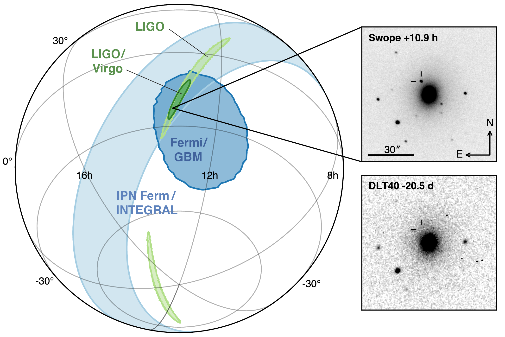

Transient astronomy
===================

Gamma-ray burst observatories
-----------------------------

There are currently four major gamma-ray burst observatories located on
Earth-orbitting satellites.

:glossary:abbr:`bat`
    A gamma ray detector on the Neil Gehrels *Swift* Observatory with a
    large field of view (over 1 steradian with high positional accuracy,
    and three with lower accuracy--the whole sky is :math:`4 \pi`
    steradians) which can roughly localise a glossary:abbr:`grb` within 15 seconds.
:glossary:abbr:`gbm`
    A gamma ray detector on the Fermi Gamma-ray Space Telescope which is
    composed of twelve scintillation detectors giving whole-sky coverage
    (except for the part of the sky obscured by the Earth).
INTEGRAL
    The INTEGRAL satellite, like gls:gbm, provides all-sky coverage and
    localisation of :glossary:abpl:`grb`.
AGILE
    A gamma ray telescope with a narrower field of view than the other
    three instruments which are dedicated to :glossary:abbr:`grb` detection, but
    which has observed a large number of :glossary:abpl:`grb`.

    
The proposed THESEUS mission, under development by the European Space Agency is a :glossary:abbr:`grb` and X-ray observatory planned for launch around 2032.
The timing of this mission's launch would mean that both THESEUS and :glossary:gls:`lisa` would be observing simultaneously.

Optical surveys
---------------

Optical surveys are an important aspect of transient astronomy, and they promise to allow very rapid detection of short-lived astrophysical events such as supernovae and kilonovae.
While sky surveys are nothing new in the world of astronomy, dating back to the development of catalogues such as Messier's in the 18th Century, the ability to conduct a survey over a very large area of the sky very rapidly has only become possible thanks to development in both sensor technology and data
processing techniques in the last decade.
A current example of such a survey telescope is the :glossary:abbr:`ztf`  :cite:`2014htu..conf...27B`, which is capable of imaging a 47 square degree area of the sky in a single exposure, allowing the entire Northern hemisphere sky to be imaged every three nights, to a limiting magnitude around 20.5. The :glossary:abbr:`ztf` produces large quantities of data every night, but this will be dwarfed by the quantity of data produced by the :glossary:abbr:`lsst`.
This facility, which has been designed specifically for rapid all-sky surveys (compared to :glossary:abbr:`ztf`, which is an instrument placed on an exisiting telescope) will produce around ten times more data, around 15 terabytes per night, proving a formidable challenge to both data processing and analysis.
Other important programmes in transient astronomy include the One-Meter Two-Hemisphere collaboration (comprising the Swope Supernova Survey in Chile, and the Nickel Telescope in California) who were the first to discover the optical counterpart to GW170817 :cite:`2017Sci...358.1556C`, and on a somewhat longer timescale, ESA's *Gaia* mission :cite:`2019IAUS..339...12B`.

Challenges for GW event follow-up
=================================

While preparing alerts based on :glossary:abbr:`gw` observations is challenging,
attempting to make :glossary:abbr:`em` observations to follow these up is not
without problems. The localisation of most :glossary:abbr:`gw` events is poor,
meaning that the event could originate anywhere within a large patch (or
large patches) of the sky. The majority of :glossary:abbr:`em` observatories can
perform observations over only a small field of view, however, and the
:glossary:abbr:`em` emission related to a glossary:abbr:`gw` event may be short-lived. As a
result an :glossary:abbr:`em` observatory must be able to rapidly survey a large
area of sky with high sensitivity.

The sky localisations which are published by :glossary:abbr:`gw` detectors are
divided into observing "tiles" by each follow-up observatory
:cite:`2016A&A...592A..82G`. The size of each tile will vary depending on
the sensitivity and field-of-view of the telescope. Each tile is then
prioritised using probability information from the :glossary:abbr:`gw` analysis
:cite:`2017ApJ...834...84C,2019MNRAS.489.5775C`, and taking into account
difficulties in moving the telescope and the period of local night.

GW170817: A case-study
======================

.. _fig-gw170817-localisation:

	   
   The sky localisation for :glossary:gls:`GW170817`.
   The localisation region from the two LIGO detectors is shown in light green, and from the LIGO and Virgo network in dark green.
   
   The light blue band is the localisation derived from the time delay between the Fermi and INTEGRAL observations of the :glossary:abbr:`sgrb`, GW 170817A.
   The images on the right are the first optical observation by Swope [top], and an image of the same galaxy taken 21 days prior to the event by the DLT40 survey.
   This figure is reproduced from figure 1 of :cite:`2017ApJ...848L..12A`.

On 17 August 2017, during the second observing run of advanced LIGO, and
a few days after advanced Virgo had started making observations a
:glossary:abbr:`gw` signal, GW170817, was detected by both LIGO detectors and the
Virgo detector. In contrast to previous :glossary:abbr:`gw` detections which had all
been :glossary:abbr:`bbh` signals, GW170817 was identified as being produced by a
:glossary:abbr:`bns` system.

Independently of the :glossary:abbr:`gw` detection the Fermi and INTEGRAL satellites
detected a :glossary:abbr:`sgrb` slightly less than two seconds after the time the
:glossary:abbr:`bns` was detected in :glossary:abpl:`gw`. GCN alerts were issued rapidly for
both the Fermi :glossary:abbr:`sgrb` detection (within 14 seconds) and the
LIGO/Virgo :glossary:abbr:`gw` detection (within 40 minutes).

The (recently-expanded) three detector :glossary:abbr:`gw` network initially
localised the signal to within 31 square degrees in the southern
celestial hemisphere, however later analysis allowed this to be reduced
to a 28 square degree patch of sky. The localisation areas from the
various detections are shown in :num:`figure #fig-gw170817-localisation` for
the :glossary:abbr:`gw` detections in green and the :glossary:abbr:`sgrb` detections in blue.

The three-detector localisation was calculated by around 17:54 UTC,
which allowed telescopes in South America to search the localisation
area for an optical transient  [5]_. The Swope supernova survey was the
first collaboration to observe the transient
:cite:`2017ApJ...848L..12A,2017Sci...358.1556C` (although six observatories
would independently discover the optical counterpart
:cite:`2017ApJ...848L..12A`). The optical counterpart was observed in NGC
4993.

The highly-precise localisation which was produced by imaging the
optical counterpart allowed observations to be made across the entire
:glossary:abbr:`em` spectrum.

Ultraviolet emission was detected 15.3 hours after the event by Swift,
and 9 days later X-ray emission was detected by the Chandra X-ray
Observatory. 16 days after the :glossary:abbr:`bns` was observed radio emission was
observed by the VLA in New Mexico.

:glossary:abbr:`em` observations continued until 2019, with the Hubble Space
Telescope unable to detect any optical afterglow after 584 days
:cite:`2019ApJ...883L...1F`. Superluminal radio emission was also reported
:cite:`2018Natur.561..355M` between 75 and 230 days after the :glossary:abbr:`bns` merger.
